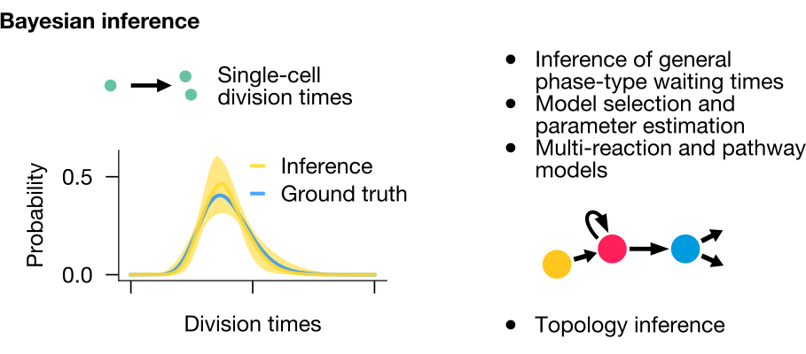

.. image:: https://img.shields.io/pypi/v/memocell.svg
    :target: https://pypi.python.org/pypi/memocell
    :alt: Latest PyPI version

.. image:: https://github.com/mauricelanghinrichs/memocell/actions/workflows/CI.yml/badge.svg
   :target: https://github.com/mauricelanghinrichs/memocell/actions/workflows/CI.yml
   :alt: Latest CI build status

.. image:: https://codecov.io/gh/mauricelanghinrichs/memocell/branch/master/graph/badge.svg?token=feWWjm4Uow
   :target: https://codecov.io/gh/mauricelanghinrichs/memocell

.. image:: https://readthedocs.org/projects/memocell/badge/?version=latest
   :target: https://memocell.readthedocs.io/en/latest/?badge=latest
   :alt: Documentation Status

MemoCell - Bayesian inference of stochastic cellular processes with and without memory in Python.

⚠️ IMPORTANT NOTE: MemoCell is in the final stage before
the first official release. A biorxiv paper presenting MemoCell will also be
released soon. Once we remove this note you are ready to go. Stay tuned❗ ⚠️

Getting Started
---------------

Installation
^^^^^^^^^^^^

MemoCell requires an installation of a recent Python version; Python can be
installed via `Anaconda <https://docs.anaconda.com/anaconda/install/>`_.

Make sure to have ``graphviz`` and ``pygraphviz`` installed before installing ``memocell``; for
example by executing the following in the terminal::

   conda install graphviz
   conda install pygraphviz

Then ``memocell`` can be installed by running::

   pip install memocell

Other dependencies should be installed automatically during the ``memocell`` installation.

Workflow Example
^^^^^^^^^^^^^^^^

A small workflow example of MemoCell is introduced (and continued in the code
examples). We look at a simple stochastic process of cell divisions,
where each realisation (/experimental repeat) starts from a single cell initially
(Figure below, left panel). This initial cell and all its daughter cells will
divide according to a certain distribution of division times.
We want to infer this waiting time distribution which is often hard to measure
directly.

To do this, MemoCell requires (typically more accessible) cell count level data.
In this case, these could be cell numbers observed at one single time point after
the start of the experiment/process (Figure below, right panel).

With the specification of a prior model space (which we skip
here, see code examples), MemoCell will update this prior by the data
to obtain posterior knowledge. Afterwards, Bayesian-averaged outputs over the
complete posterior model space are computed for faithful inferences, such as an
estimate for the distribution of cell division times. The estimate by MemoCell
recovers the unobserved, ground truth of the test data set (Figure below,
left panel).

Internally, MemoCell compares data and stochastic models by summary statistics
of the so-called moments (mean, variance, covariance of cell counts).
This allows exact and relatively fast inferences of the (possibly
non-Markovian) stochastic models.

MemoCell is designed for inferences in multi-reaction pathways of multiple
cell types as well; to learn, for example, reaction rates, general phase-type
waiting time distributions or model topologies (Figure above, right panel).

Of course, one may also apply MemoCell to any other discrete-state-space
time-continuous data, such as gene expression and mRNA count data; requirement is
that the processes of interest can be represented by the set of zero- and
first-order reaction types available in MemoCell.

Code Examples
^^^^^^^^^^^^^

Concrete code and usage examples can be found in the above folder ``examples``
(as jupyter notebooks). If they don't render correctly by github,
copy-paste the entire URL into `nbviewer <https://nbviewer.jupyter.org>`_;
alternatively, you may download and run them yourself.

Documentation
-------------

Documentation can be found at
`readthedocs <https://memocell.readthedocs.io/en/latest/getting_started.html>`_.
It includes an extensive
`API <https://memocell.readthedocs.io/en/latest/api.html>`_ detailing all
classes and functions of MemoCell.

License
-------

This package can be used under the MIT License (MIT), see LICENSE file.

Authors
-------

MemoCell was written and developed by
`Maurice Langhinrichs <m.langhinrichs@icloud.com>`_
and `Lisa Buchauer <lisa.buchauer@posteo.de>`_
`@TSB <https://www.dkfz.de/en/modellierung-biologischer-systeme/>`_.

Citation
--------

The release paper of MemoCell can be found here ``[TODO add link]``.

Please cite this publication as

``TODO add citation``

This work is based on many people's previous achievements; please find
the complete list of references in our release paper.
