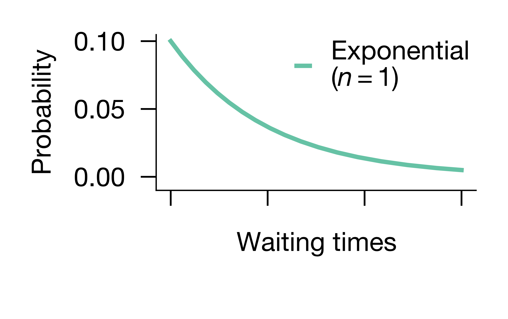
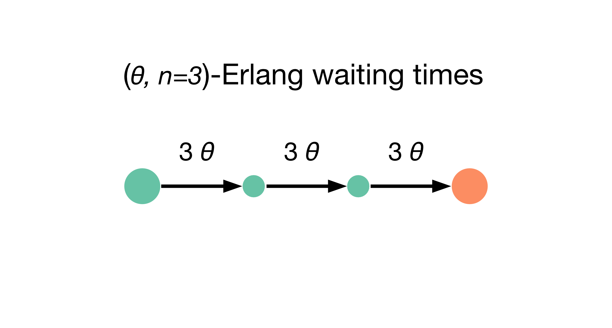
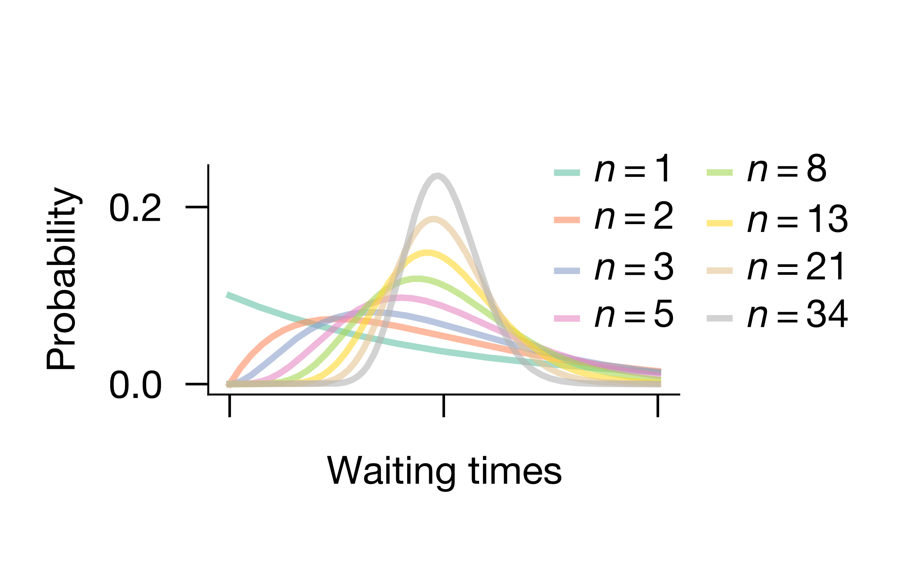
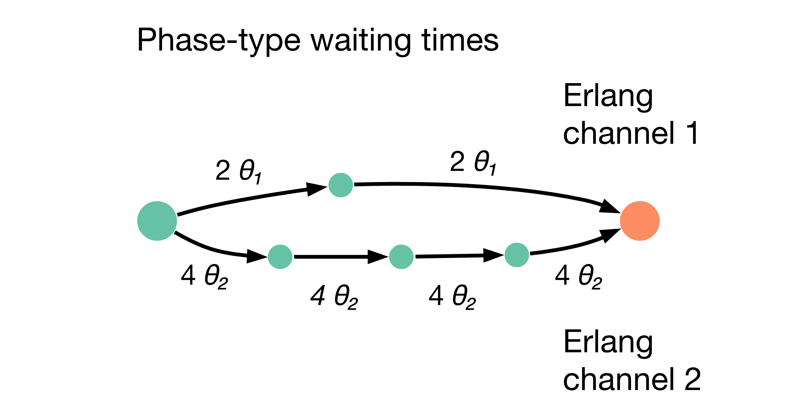
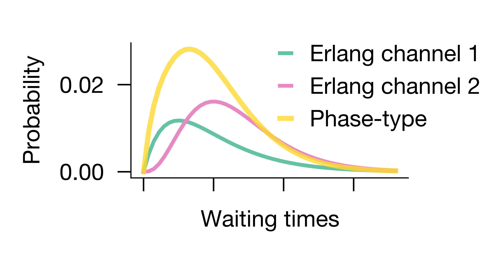
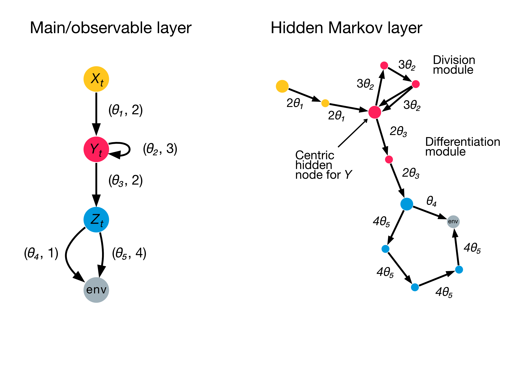

Theory
======

Waiting Times and Memory
^^^^^^^^^^^^^^^^^^^^^^^^
A single cell spends a stochastic amount of time to execute a division, death
or differentiation event -- the so-called waiting time :math:`\tau`. The
distribution of waiting times in cell populations, as an ensemble of many
single-cell fates, hence quantifies the probabilistic dynamics of basic
cellular decisions. Subsequently, we will outline the theoretical concepts
employed in MemoCell to describe and infer stochastic processes of multiple
possibly interlinked waiting time distributions.

We introduce waiting time distributions from the "view" of a single cell
executing a single reaction (e.g., a differentiation event). The next section
then generalises the concepts for an ensemble of cells, also being subject
to cellular pathways of multiple reactions.

The most basic waiting time distribution is the exponential distribution
(see Figure below); :math:`\tau \sim \mathrm{Exp}(\theta)` where
:math:`\theta` is the rate parameter. The mean waiting time is the inverse of
the rate, :math:`\mathrm{E}(\tau)=1/\theta`, and the variance is
:math:`\mathrm{Var}(\tau)=1/\theta^2`. This also implies that the variability of
exponential waiting times is always fixed, as measured by the coefficient of
variation;
:math:`\mathrm{CV}(\tau)=\frac{\sqrt{\mathrm{Var}(\tau)}}{\mathrm{E}(\tau)} = 1`.

The exponential distribution is the only continuous distribution that fulfils
the property of memorylessness, meaning
:math:`p(\tau > t + s | \tau > s) = p(\tau > t)`. This is also why stochastic
processes that fulfil the Markov property of memorylessness are characterised
by exponential waiting times for all their transition events. Markov jump
processes with exponential waiting times allow powerful analytical access (will
be used and shown). However, the exponential waiting time distribution in
itself is often not a good assumption for biological transitions. Applied to
cell division, one would assume that the next division event is most likely to
occur immediately after the previous division (the mode is at 0); contradicting
the fact that cells need a minimal time span to replicate the DNA etc.

For this reason MemoCell allows to describe and infer more general,
non-exponential waiting time distributions -- specifically the Erlang
and phase-type distributions. Indeed, phase-type distributions are "dense"
(in the mathematical sense) in the field of all positive-valued distributions;
as such, they can `approximate any` waiting time distribution `arbitrarily closely`
[#bladt]_ [#schb]_. Importantly, these distributions are constructed by
convolutions or mixtures of exponential distributions and thus we retain the
analytical tractability.

This principle is demonstrated best with the Erlang distribution. An Erlang
waiting time :math:`\tau` is generated when a single cell passes through
a sequence of :math:`n` (fictitious, hidden) states, each with independent and
identically distributed exponential waiting times :math:`\tau_i`,
:math:`i=(1,...,n)` [#erl09]_. In MemoCell we parametrise
:math:`\tau_i \sim \mathrm{Exp}(n \theta)`; then
:math:`\tau = \sum_i \tau_i \sim \mathrm{Erl}(n,n\theta)` is Erlang distributed
with mean :math:`\mathrm{E}(\tau)=1/\theta` and variance
:math:`\mathrm{Var}(\tau)=1/(n \theta^2)`. The Figure below illustrates the
transition graph for such an :math:`(\theta, n=3)`-Erlang waiting time (to
reach the orange state, starting at the leftmost green state).

High number of steps :math:`n` can decrease the variability of the distribution
as :math:`\mathrm{CV}(\tau)=1/\sqrt{n}` (see Figure below, same mean for
all cases). The exponential distribution is the special case of the Erlang
distribution for :math:`n=1`. (For a given number of the hidden states
the Erlang distribution is actually the phase-type distribution with the lowest
variability [#erlang_cv1]_ [#erlang_cv2]_).

Next to the direct description of the waiting times as done above,
a second equivalent description of the transition process can be
given via the master equation (or Kolmogorov forward (and backward)
equation). This is possible because the process is Markovian
(exponential waiting times) on the level of the hidden states.

For the :math:`n=3` example, a single cell is either in one of the
three "green" states :math:`w_1=(1,0,0,0)`, :math:`w_2=(0,1,0,0)`,
:math:`w_3=(0,0,1,0)` or in the "orange" state :math:`w_\infty=(0,0,0,1)`.
The orange state is `absorbing`, meaning that the process will jump
into this state eventually. With the probability row vector
:math:`\pmb{p}(w, t)=\big(p(w_\infty, t), p(w_1, t), p(w_2, t), p(w_3, t) \big)`,
the complete probabilistic dynamics are given by the master
equation

.. math::
    \partial_t \, \pmb{p}(w, t) = \pmb{p}(w, t) \, Q,

where

.. math::
    Q = \begin{pmatrix}
    0 & 0 & 0 & 0 \\
    0 & -3\theta & 3\theta  & 0 \\
    0 &0 & -3\theta & 3\theta \\
    3\theta & 0 & 0 & -3\theta
    \end{pmatrix}

is the generator or transition rate matrix. The master equation is a
(here finite, but possibly infinite) system of differential equations,
balancing the probability in- and outflux for each state. Note that we can
rewrite

.. math::
    Q =
    \begin{pmatrix}
    0 & \pmb{0} \\
    \pmb{s} & S
    \end{pmatrix}
    \qquad \mathrm{with} \qquad
    S =
    \begin{pmatrix}
    -3\theta & 3\theta  & 0 \\
    0 & -3\theta & 3\theta \\
    0 & 0 & -3\theta
    \end{pmatrix}

where :math:`\pmb{s}=-S\,\pmb{1}` with :math:`\pmb{1}` a column vector of ones.
The submatrix :math:`S` is now the generator/transition rate matrix for
the `transient` states (:math:`w_1, w_2, w_3`) only.

These considerations motivate phase-type distributions. As before, we describe
the waiting time :math:`\tau` to reach one absorbing state :math:`w_\infty`;
now however, jumps may occur between :math:`m` transient states,
connected by an arbitrary transition rate matrix :math:`S` (or
subgenerator/transient generator).

We derive the phase-type density and distribution function for
:math:`\tau`. The probabilities to be in any specific transient state are
denoted by the row vector
:math:`\pmb{p}(w, t) = \big(p(w_1, t), ..., p(w_m, t) \big)`; the probability
to be in any one of them at all is their sum, i.e.
:math:`\pmb{p}(w, t) \, \pmb{1}`. Hence we have the following equations

.. math::
    p(\tau > t) = 1 - p(w_\infty, t) = \pmb{p}(w, t) \, \pmb{1},

the probability to be not yet in the absorbing state. Again, the dynamics
of the state probabilities (transient states only) are given by the master
equation :math:`\partial_t \, \pmb{p}(w, t) = \pmb{p}(w, t) \, S`. This finite
system of differential equations has the general solution

.. math::
    \pmb{p}(w, t) = \pmb{\alpha} \, \mathrm{exp}\big(S\,t\big)

where :math:`\mathrm{exp}` is the matrix exponential and the row vector
:math:`\pmb{\alpha}=\pmb{p}(w, t_0)` denotes the initial probabilities of the
transient states at :math:`t_0=0`. The inverse of the survival probability
:math:`p(\tau > t)` is the waiting time distribution function
:math:`F(t)=p(\tau \le t)=1-p(\tau > t)` and
thus we obtain

.. math::
    F_{\mathrm{PH}}(t) = 1 - \pmb{p}(w, t) \, \pmb{1}
    = 1 - \pmb{\alpha} \, \mathrm{exp}\big(S\,t\big) \, \pmb{1}

which also directly implies the probability density by differentiation

.. math::
    f_{\mathrm{PH}}(t) = \pmb{\alpha} \, \mathrm{exp}\big(S\,t\big) \, \pmb{s}
    \qquad \Leftrightarrow \qquad \tau \sim \mathrm{PH}(\pmb{\alpha}, S),

where :math:`\pmb{s}=-S\,\pmb{1}` as above. We call :math:`\tau` phase-type (PH)
distributed with initial probabilities :math:`\pmb{\alpha}` and
transient generator :math:`S`. Due to the denseness of phase-type
distributions and the fact that they arise naturally as waiting times over
transition graphs in analytically tractable Markov processes, they
constitute a powerful approach to represent virtually any waiting
time distribution. Mean and variance can be computed by
:math:`\mathrm{E}(\tau)=-\pmb{\alpha}S^{-1}\pmb{1}` and
:math:`\mathrm{Var}(\tau)= 2\pmb{\alpha}S^{-2}\pmb{1}-(\pmb{\alpha}S^{-1}\pmb{1})^2`,
respectively. Note that phase-type representations are
generally not unique, i.e. multiple transient generators may exists for the same
density and distribution function [#ph_uniq]_.

MemoCell allows to implement any phase-type waiting times (at least
theoretically; with the use of `simulation_variables`). Particularly easy to
implement are phase-type distributions of two or more parallel Erlang channels
diverging from a common start state (see application in our release paper or
Figure below).

In the Figure example we have used 2-step and 4-step Erlang channels that
together construct a quite long-tailed waiting time distribution (Figure
below); in comparison the weighted densities of the individual `(0.03,4)` and
`(0.04,2)` Erlang channels. The CV of such phase-type distributions can be
larger or smaller than (or equal to) 1.

Note that already finite mixtures of Erlang distributions are dense in the
field of positive-valued distributions [#bladt]_ [#schb]_, so we believe
that our approach may provide a versatile start point for many problems.

Stochastic Processes
^^^^^^^^^^^^^^^^^^^^

maybe it is easiest to start with introducing now the use of phase-type ideas
for different reactions assembled together in a multi-reaction network;
then they that it somehow also covers ensemble/integer cell numbers; maybe think
about this a bit more.. the given reaction types somehow enforce specific state
changes, while in the previous section there was no real assumption on this

to understand many-cell systems maybe helpful to mention the property of the
exponential distribution on the hidden layer: once many cells are placed on a
cell type their rate just amplifies with the cell number as minimum of n
exponential waiting times has n times the rate

mention that we don't fit ph distr. directly! we look at interlinked
ph distributions in networks and try to infer them via cell counts

here I have to make two main steps: ensemble level, multiple reaction;
the whole description (S, Q) before was for a single cell

maybe introduce waiting times first (as a single-reaction module, also
mention Markov processes there) and connect different modules here now for
multi-reaction pathways; and then main: how to efficiently characterise them
-> moment simulations (next to stochastic simulations)

maybe switch term from state to node or variable when describing the figure;
in the previous section they represented concrete states (i.e. (1,0,0)), but
now they 'encode' or 'induce' a whole set of states (each variable can be
in any integer and then all states arises combinatorial)

mention also MemoCell automatic symbolic derivation and metaprogramming
features

say we implement phase-type (and Erlang) now for different reactions (before
we had more states that could have been anything); write again this phrase
that a reaction is realised only with the final jump into the absorbing state
/ which executes the stochiometric change of the reaction, while all transitions
between the transient states or variables are hidden (differentiation reaction
between hidden variables of the same cell type that cannot be seen on the
observable layer)

maybe now also mention when we talk about cell numbers for the first time
really (not just a single cell) that we deal with infinite sized integer
systems, hence master equation for the whole process infinite dimensional
and no solution can be directly obtained via matrix exp

general master equation for Markov jump processes (continuous time, discrete
state space); SEE NEW notes on Goodnotes: maybe remove this initial condition thing
and directly write the general ME, starting from initial distribution p(w0, t0);
mention that all are 1xn row vectors

maybe focus here in this first section on the "single cell view"; say in next
section that this is can applied automatically for many cells running through the
transition graphs and networks

rates we introduce are the rates of single cells passing through such schemes

maybe mention the scaling with the run time in variance/covariance mode, that
people dont expect too much for large networks... the #moment_eqs scales
quadratically with the number of hidden layer variables, maybe copy-paste
exact formula here from paper methods

maybe mention that also ph are closed under minima and so on (order stats
in general?)

maybe also mention exponential split probabilities to enter the different
channels; theta/(sum over all theta diverging)

maybe say how the competition is implemented (for more than one module starting
at a main variable, we split at its centric hidden variable), or even show a
scheme (similar to schemes above for Erlang and PH2 channels); maybe also say
that other thing than this competition can be implemented via simulation variables
for example minimum or maximum between two channels (ph closed under order
statistics).

mention that reactions start at centric hidden node

mention that we split multi reaction system that diverge from the same cell type
as split at the first reaction; however one can also implement other stuff
such as min / max of these channels using simulation_variables; then link to
reference [#min_max_ph]_

reaction types; maybe change notation as in methods with :math:`W^{(i)}` and
:math:`W^{(k)}` variables.

- :math:`S \rightarrow E` (cell differentiation),

- :math:`S \rightarrow S + S` (symmetric self-renewing division),

- :math:`S \rightarrow S + E` (asymmetric division),

- :math:`S \rightarrow E + E` (symmetric differentiating division),

- :math:`S \rightarrow` (efflux or cell death) and

- :math:`\rightarrow E` (influx or birth),

hidden and main variables?

summation formula? for variables and for mean, variance, covariance?

approach based on G to get ODE for the moments? maybe mention at least which
moments are solved

maybe mention summation formulas, but skip the part how to solve them via
PDE (in formulas) at least; just they we get ODE system for these hidden
layer moments

write that MemoCell can produce moment AND stochastic simulations for the
class of cell pathway processes (/general waiting time
stochastic models with the above reaction types)

what about initial conditions? ref to API?

.. math::
    W^{(i)}_t = \sum\nolimits_{j\in\{1,...,u_i\}} W^{(i,j)}_t

for any fixed :math:`i \in \{1,...,v\}`.

mean:

.. math::
    \mathrm{E}\big(W^{(i)}_t\big) = \sum\nolimits_{j\in\{1,...,u_i\}}
    \mathrm{E}\big(W^{(i,j)}_t\big)

covariance and variance:

.. math::
    \mathrm{Var}\big(W^{(i)}_t\big) = \sum\nolimits_{j} \mathrm{Var}\big(W^{(i,j)}_t\big)
    + 2 \sum\nolimits_{j,l | j<l} \mathrm{Cov}\big(W^{(i,j)}_t, W^{(i,l)}_t\big)

where :math:`j,l \in\{1,...,u_i\}`.

.. math::
    \mathrm{Cov}\big(W^{(i)}_t, W^{(k)}_t\big) =
    \sum\nolimits_{j}\sum\nolimits_{l} \mathrm{Cov}\big(W^{(i,j)}_t, W^{(k,l)}_t\big)

where :math:`j \in\{1,...,u_i\}` and :math:`l \in\{1,...,u_k\}`.

the variance and covariances on the hidden layer can be decomposed into
second factorial and mixed moments:
:math:`\mathrm{Var}(X)=\mathrm{E}(X(X-1))+\mathrm{E}(X)-\mathrm{E}(X)^2`
and :math:`\mathrm{Cov}(X, Y)=\mathrm{E}(X Y)-\mathrm{E}(X) \mathrm{E}(Y)`

MemoCell solves :math:`\mathrm{E}\big(W^{(i,j)}_t\big)`,
:math:`\mathrm{E}\big(W^{(i,j)}_t \, (W^{(i,j)}_t-1)\big)` and
:math:`\mathrm{E}\big(W^{(i,j)}_t \, W^{(k,l)}_t\big)` for all hidden variables
:math:`i,k \in \{1,...,v\}`, :math:`i \ne k`, :math:`j \in \{1,...,u_i\}`,
:math:`l \in \{1,...,u_k\}`.

Bayesian Inference
^^^^^^^^^^^^^^^^^^

ref mackay maybe

state main Bayes theorems for model selection and parameter estimation

mention likelihood function? (maybe reference to API here, as log likelihood)

mention nested sampling

allows Bayesian-averaged inference over the complete model space, introduce
formula and sampling procedure (maybe link to API)

.. math::
    p(\pmb{\theta}_k | D, M_k) = \frac{p(D | \pmb{\theta}_k, M_k) \, p(\pmb{\theta}_k| M_k)}{p(D | M_k)}
    = \frac{\mathcal{L}(\pmb{\theta}_k) \, \pi(\pmb{\theta}_k)}{Z_k}

.. math::
    p(M_k | D) = \frac{p(D | M_k) \, p(M_k)}{p(D)}
    = \frac{Z_k \, p(M_k)}{p(D)}

it is sufficient to know model evidence and model prior to know the model
posterior distribution, as :math:`p(D)` can be calculated as
probability-normalizing factor.

parameter prior, for each parameter :math:`\theta` in the vector :math:`\pmb{\theta}`
one has to specify

.. math::
    \pi(\theta) = \left. \begin{cases} 1 / (b_u - b_l) & \text{if } \theta \in [b_l, b_u] \\
    0 & \text{else} \end{cases} \right\}

evidence integral via nested sampling...

.. math::
    Z_k = \int\nolimits_{\Theta_k} \mathcal{L}(\pmb{\theta}_k) \, \pi(\pmb{\theta}_k) \, \mathrm{d}\pmb{\theta}_k
    = \int\nolimits_{0}^{1} \mathcal{L}(X) \, \mathrm{d}X

where :math:`\Theta_k` denotes the entire parameter domain. and the second integral
is the one solved in nested sampling, introducing a prior mass :math:`X` sorted
by the likelihood (ref to dynesty, or methods in release paper). second integral
is reparametrised.

nested sampling also yields bona fide posterior parameter samples, when they
are weighted as :math:`p(\pmb{\theta}_i) = \mathcal{L}_i \, \Delta X_i / Z`, where :math:`i` indicates the
samples of the :math:`i`-th iteration of a nested sampling run. So use
`est.bay_est_samples_weighted` of an estimation instance `est` in MemoCell.

Bayesian-averaged output over entire model space

.. math::
    p(X|D) = \sum\nolimits_{k=1}^{m} \int\nolimits_{\Theta_k} \,
    p(X|\pmb{\theta}_k, M_k, D) \, p(\pmb{\theta}_k | M_k, D) \,
    p(M_k | D) \, \mathrm{d}\pmb{\theta}_k

where typically :math:`p(X|\pmb{\theta}_k, M_k, D)=p(X|\pmb{\theta}_k, M_k)`
(posterior model contains all info to compute :math:`X`). describe sampling
procedure, read eq. from right to left; maybe also add topology
inference of an application of this

Subsampling from Compartments
^^^^^^^^^^^^^^^^^^^^^^^^^^^^^

In some experimental settings you may not observe the cell counts of the
biological process directly, but only a subsampled fraction of them. MemoCell
can still be applied in these settings; however the approximate percentage
of subsampling has to be known and one should apply a correction for the
subsampling (e.g., as below).

Let :math:`N` be the random cell numbers of the compartment (which we want to
know for MemoCell) and :math:`X` be the subsampled cell numbers (which we actually
have observed). For :math:`N` much larger than :math:`X`, the binomial distribution
can be used to model the sampling process (otherwise, the hypergeometric
distribution should be used); we have

.. math::
    X | N \sim \mathrm{Bin}(N, \alpha)

where :math:`\alpha \in (0, 1]` is the subsampling fraction. Then, the main idea is
to rescale the observed counts :math:`X` with the subsampling fraction :math:`\alpha`
and introduce

.. math::
    S = \frac{X}{\alpha}

as an estimate for :math:`N` for each cell type / variable of interest.

Based on the law of total expectation (and variance/covariance),
one can directly show relations for the mean

.. math::
    \mathrm{E}(N) = \mathrm{E}(S),

the variance

.. math::
    \mathrm{Var}(N) = \mathrm{Var}(S) - \frac{\alpha (1-\alpha)}{\alpha^2} \mathrm{E}(S)

and the covariance (between two different variables, each subsampled with
:math:`\alpha_1` and :math:`\alpha_2`, respectively)

.. math::
    \mathrm{Cov}(N_1, N_2) = \mathrm{Cov}(S_1, S_2).

These relations mean that the rescaled data correctly reflect the means and
covariances of the original cell counts, whereas the variance needs to be
corrected as above (to remove the additional noise caused by the subsampling,
right term on the rhs, from the biological variability, left term on the rhs).

`Example`: We measure samples of :math:`X` as :math:`x \in \{7, 11, 4\}`
with a subsampling fraction of 20 %, i.e. :math:`\alpha=0.2`. Then, realisations
of :math:`S` are :math:`s \in \{35, 55, 20\}` and estimates for mean and variance
of the rescaled data are :math:`\mathrm{E}(S)\approx 36.7`
and :math:`\mathrm{Var}(S) \approx 308.3` (`ddof=1`). Hence, the subsampling
corrected mean and variance estimates that we load to MemoCell are
:math:`\mathrm{E}(N) = \mathrm{E}(S) \approx 36.7` and
:math:`\mathrm{Var}(N) = \mathrm{Var}(S) -  \frac{\alpha (1-\alpha)}{\alpha^2} \mathrm{E}(S) \approx 161.7`.

.. rubric:: References

.. [#erlang_cv1] Aldous, D., and Shepp, L. (1987). The least variable phase type distribution is erlang. Commun. Stat. Stoch. Models 3, 467–473.
.. [#bladt] Bladt, M., and Nielsen, B.F. (2017). Matrix-Exponential Distributions in Applied Probability (Springer).
.. [#cinlar] Çinlar, E. (2013). Introduction to Stochastic Processes (Dover Publications, Inc).
.. [#cox55] Cox, D.R. (1955). A use of complex probabilities in the theory of stochastic processes. Math. Proc. Camb. Philos. Soc. 51, 313–319.
.. [#erl09] Erlang, A.K. (1909). Sandsynlighedsregning og Telefonsamtaler. Nyt Tidsskr. Mat. 20, 33–39.
.. [#gill1] Gillespie, D.T. (1976). A general method for numerically simulating the stochastic time evolution of coupled chemical reactions. J. Comput. Phys. 22, 403–434.
.. [#gill2] Gillespie, D.T. (1977). Exact stochastic simulation of coupled chemical reactions. J. Phys. Chem. 81, 2340–2361.
.. [#min_max_ph] Hurtado, P.J., and Kirosingh, A.S. (2019). Generalizations of the ‘Linear Chain Trick’: incorporating more flexible dwell time distributions into mean field ODE models. J. Math. Biol. 79, 1831–1883.
.. [#jensen] Jensen, A. (1949). Distribution patterns composed of a limited number of exponential distributions. In Den 11. Skandinaviske Matematikerkongres, (Trondheim), pp. 209–215.
.. [#mackay] MacKay, D.J.C. (2003). Information Theory, Inference, and Learning Algorithms (Cambridge University Press).
.. [#ph_uniq] O’Cinneide, C.A. (1989). On non-uniqueness of representations of phase-type distributions. Commun. Stat. Stoch. Models 5, 247–259.
.. [#erlang_cv2] O’Cinneide, C.A. (1991). Phase-Type Distributions and Majorization. Ann. Appl. Probab. 1, 219–227.
.. [#schb] Schassberger, R. (1973). Warteschlangen (Springer Verlag).
.. [#skilling] Skilling, J. (2006). Nested sampling for general Bayesian computation. Bayesian Anal. 1, 833–860.
.. [#dynesty] Speagle, J.S. (2020). dynesty: a dynamic nested sampling package for estimating Bayesian posteriors and evidences. Mon. Not. R. Astron. Soc. 493, 3132–3158.
